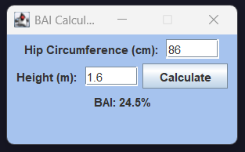

# Overview
Body Adiposity Calculator is a Java Swing application that calculuates and presents a person's Body Adiposity Index (BAI) through an intuitive and simple GUI.
Rising as an alternative to the more standard Body Mass Index (BMI), BAI is sometimes viewed as a more accurate measure of estimating body fat percentage by using hip circumference and height, rather than weight and height as used in BMI.
Designed to be a human-centered application, users are presented with a minimalistic and easy interface that includes input validation.
Users are able to input their hip circumference (CM) and height (M) through the GUI, being able to calculate and view their BAI instantly through the click of a button.

This project demonstrates object-oriented programming concepts, GUI programming, exception handling, and human-centered design.
Note: The GUI application was manually created without using the drag-and-drop toolkit.

## Technologies Used
- Java 23 (OpenJDK)
- Java Swing
- IntelliJ IDEA

## Features
- **Exception Handling**
  - User receives a warning message given invalid input
  - User has infinite attempts to enter valid input
  - Prevents non-numerical values and empty text fields from being entered
  - Application crash likelihood is reduced with a Try...Catch block
- **Objected-Oriented Programming**
  - Uses separate classes for Main and BAIFrame logic
- **GUI Programming**
  - Interactive GUI allows users to enter input without seeing the console
  - BAI is dynamically updated when the "Calculate" button is clicked after input changes
  - Visual customization makes the interface readable and easy to use
- **Human-Centered Design**
  - Simple and intuitive graphic interface
  - Provides user with immediate feedback
- **User Input**
  - User can input their hip circumference (CM) and height (M)
- **Calculate Button**
  - User can instantly compute their BAI through clicking one button
  - Presents itself simply while complex behind-the-scenes logic runs

## Sample Run

